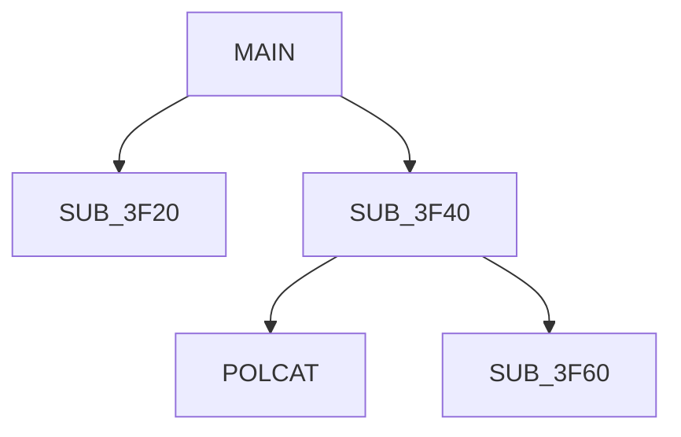

# Trace Call Graph

## Steps

1. **Disassemble** the binary using `python3 tools/dasm6809.py`
2. **Build cross-references** using `python3 tools/xref.py`
3. **Trace from entry point**:
   - Start at the exec address (DECB) or ORG address (raw)
   - Follow each JSR/BSR/LBSR call
   - Track the call depth (max recursion level)
   - Identify loops (branches backward)
   - Mark conditional vs unconditional branches
4. **Classify subroutines**:
   - **Leaf functions**: No outgoing calls (typically utility routines)
   - **Branch nodes**: Call other subroutines
   - **Interrupt handlers**: Reached via RTI
   - **ROM bridges**: Single JSR to a ROM entry point (wrappers)
5. **Generate call tree** as indented text or Mermaid diagram

## Output Formats

### Text tree
```
MAIN ($3F00)
├── SUB_3F20 - Initialize screen
│   └── CLS ($A59A) [ROM]
├── SUB_3F40 - Main loop
│   ├── POLCAT ($A928) [ROM]
│   ├── SUB_3F60 - Process input
│   │   └── PUTCHR ($A176) [ROM]
│   └── SUB_3F80 - Update display
└── SUB_3FA0 - Cleanup
```

### Mermaid diagram

